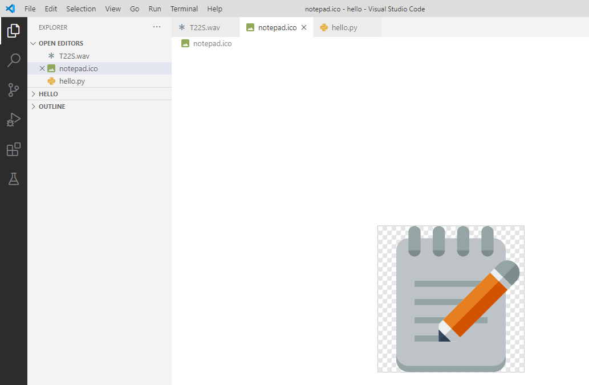
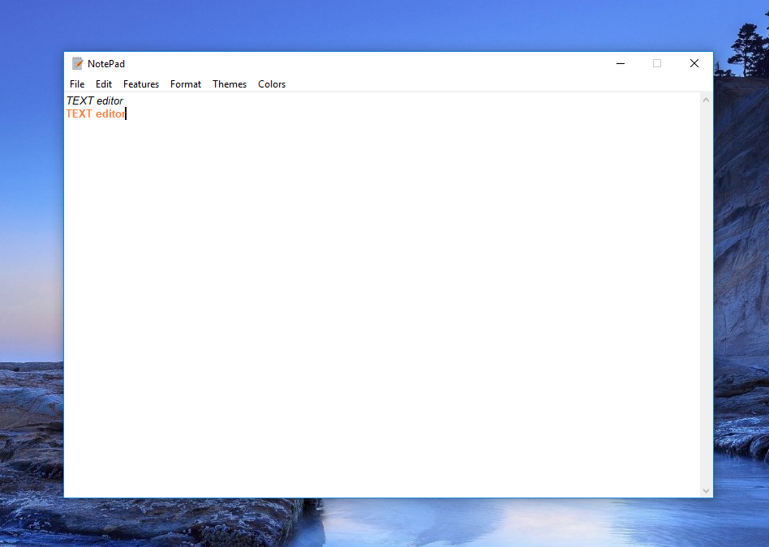

# Description
TextEditor with SpeechRecognition with ***Text to Speech***, ***Speech to Text***, and ***Spell Check*** features.  

## Done by
Bolot Zhusupekov\
Kalmyrza Zholchubekov

## Setup
First install all necessary modules,
```
pip install tkinter 
***
pip install gtts # a Python library and CLI tool to interface with Google Translate text-to-speech API.
***
pip install os #  a module in python that provides functions for interacting with the operating system.
***
pip install textblob # a library for processing textual data.
***
pip install SpeechRecognition # Library for performing speech recognition, with support for several engines and APIs, online and offline.

```
#### If you have problem with installing SpeechRecognition module. Run below commands on the terminal. 

```
pip install pipwin
***
pipwin install pyaudio
***
pip install SpeechRecognition
```

## Usage

1.Download logo and audiofile to your folder


[audio](T22S.wav)



2. After running should appear texteditor window


